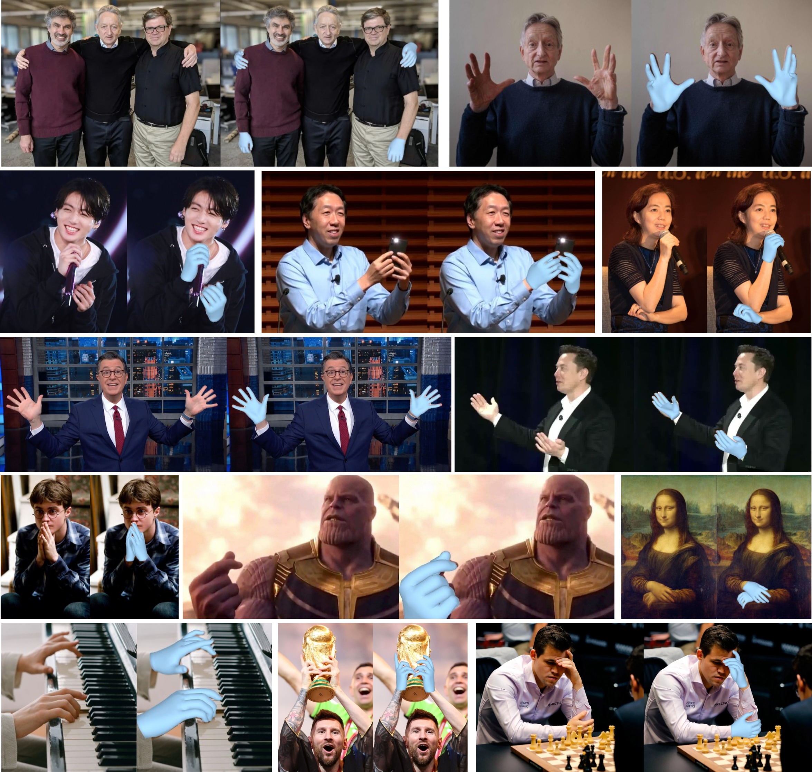
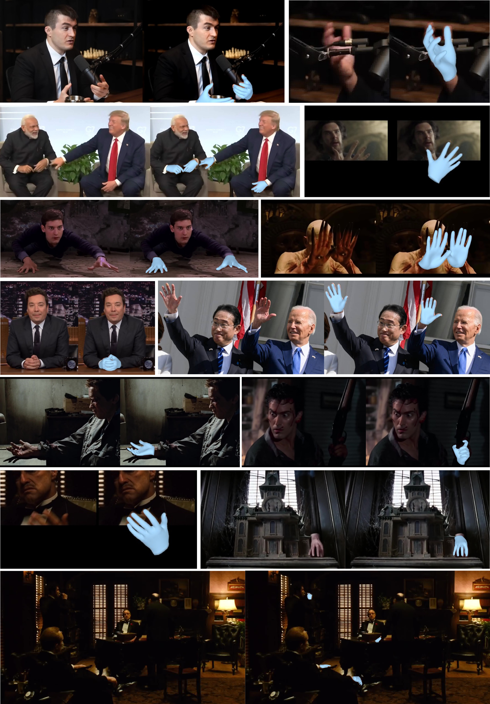

<div align="center">

# Hamba: Single-view 3D Hand Reconstruction with <br>Graph-guided Bi-Scanning Mamba
<div>
    <a href='https://www.haoyed.com/' target='_blank'>Haoye Dong*</a>&emsp;
    <a href='https://aviralchharia.github.io/' target='_blank'>Aviral Chharia*</a>&emsp;
    <a href='https://www.linkedin.com/in/wenbogou' target='_blank'>Wenbo Gou*</a>&emsp;</br>
    <a href='https://scholar.google.com/citations?user=3elKp9wAAAAJ' target='_blank'>Francisco Vicente Carrasco</a>&emsp;
    <a href='https://www.cs.cmu.edu/~ftorre/' target='_blank'>Fernando De la Torre</a>&emsp;
</div>
<div>
    Carnegie Mellon University&emsp;<br>
    *Equal Contribution
</div>
<div>
    <b>arXiv 2024</b>
</div>
<br>


  <a href="https://arxiv.org/abs/2407.09646"></a>
  <a href="https://humansensinglab.github.io/Hamba"></a>
  [](https://github.com/humansensinglab/Hamba)


<p align="left">
  <a href="https://paperswithcode.com/sota/3d-hand-pose-estimation-on-freihand?p=hamba-single-view-3d-hand-reconstruction-with"></a><br>
    <a href="https://paperswithcode.com/sota/3d-hand-pose-estimation-on-ho-3d?p=hamba-single-view-3d-hand-reconstruction-with"></a><br>
    <a href="https://paperswithcode.com/sota/3d-hand-pose-estimation-on-ho-3d-v3?p=hamba-single-view-3d-hand-reconstruction-with"></a><br>
    <a href="https://paperswithcode.com/sota/3d-hand-pose-estimation-on-hint-hand?p=hamba-single-view-3d-hand-reconstruction-with"></a><br>
</p>  

---




<strong> Our method Hamba can achieve an accurate and robust reconstruction of 3D Hands.</strong><br>
:open_book: For more visual results, go checkout our <a href="https://humansensinglab.github.io/Hamba/" target="_blank">project page</a>
</div>

---

## :rocket: **Updates**
- <i>More Coming Soon</i>
- 🔲 **Coming Soon!**: Hamba Hugging Face and Codes. <i>Test Hamba with a single click!</i>
- ✅ **Jul. 16, 2024**: We released the Hamba project page. <i>Check it out!</i>
- ✅ **Jul. 12, 2024**: We released the Hamba Paper on arXiv.

## :open_book: **Abstract**
3D Hand reconstruction from a single RGB image is challenging due to the articulated motion, self-occlusion, and interaction with objects. Existing SOTA methods employ attention-based transformers to learn the 3D hand pose and shape, but they fail to achieve robust and accurate performance due to insufficient modeling of joint spatial relations. To address this problem, we propose a novel graph-guided Mamba framework, named Hamba, which bridges graph learning and state space modeling. Our core idea is to reformulate Mamba’s scanning into graph-guided bidirectional scanning for 3D reconstruction using a few effective tokens. This enables us to learn the joint relations and spatial sequences for enhancing the reconstruction performance. Specifically, we design a novel Graph-guided State Space (GSS) block that learns the graph-structured relations and spatial sequences of joints and uses 88.5% fewer tokens than attention-based methods. Additionally, we integrate the state space features and the global features using a fusion module. By utilizing the GSS block and the fusion module, Hamba effectively leverages the graph-guided state space modeling features and jointly considers global and local features to improve performance. Extensive experiments on several benchmarks and in-the-wild tests demonstrate that Hamba significantly outperforms existing SOTAs, achieving the PA-MPVPE of 5.3mm and F@15mm of 0.992 on FreiHAND. Hamba is currently <strong>Rank 1</strong> in two challenging competition leaderboards on 3D hand reconstruction. The code will be available upon acceptance.

## :bookmark_tabs: Citation
If you find our work useful for your project, please consider adding a star to this repo and citing the paper:
```bibtex
    @misc{dong2024hambasingleview3dhand,
        title={Hamba: Single-view 3D Hand Reconstruction with Graph-guided Bi-Scanning Mamba}, 
        author={Haoye Dong and Aviral Chharia and Wenbo Gou and Francisco Vicente Carrasco and Fernando De la Torre},
        year={2024},
        eprint={2407.09646},
        archivePrefix={arXiv},
        primaryClass={cs.CV},
        url={https://arxiv.org/abs/2407.09646}, 
    }
